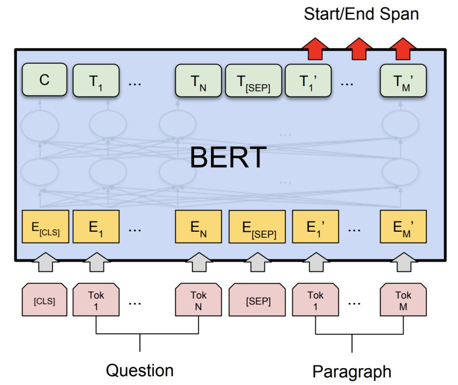
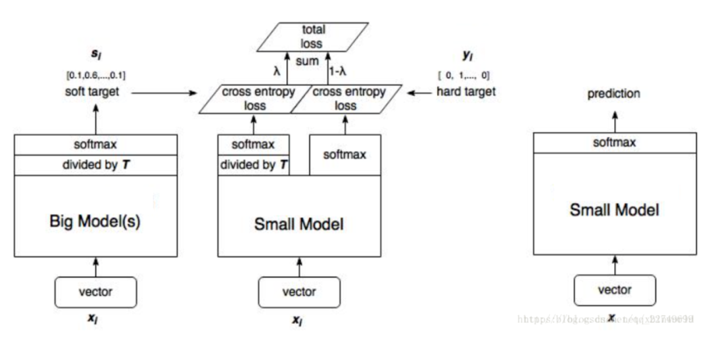

# bert

----

1. Pre-training **预训练** of Deep Bidirectional **双向** Transformers **Transformers** for Language Understanding
1. BERT采用Masked LM + Next Sentence Prediction作为pre-training tasks, 完成了真正的Bidirectional LM
1. BERT模型能够很容易地Fine-tune，并且效果很好，并且BERT as additional feature效果也很好

---

## 模型介绍

[bert一些点](https://zhuanlan.zhihu.com/p/242253766)

### 输入的表示

1. Token embedding 表示当前词的embedding
1. Segment Embedding 表示当前词所在句子的index embedding
1. Position Embedding 表示当前词所在位置的index embedding

1. 每句话的第一个token总是[CLS]。对应它的最终的hidden state(即Transformer的输出)用来表征整个句子，可以用于下游的分类任务。
1. 模型能够处理句子对。为区别两个句子，用一个特殊token [SEP]隔开它们，另外针对不同的句子，把学习到的Segment embeddings 加到每个token的embedding上(如图)

### 预训练

1. Masked LM

1. 80%的概率真的用[MASK]取代被选中的词。比如 my dog is hairy -> my dog is [MASK]
1. 10%的概率用一个随机词取代它：my dog is hairy -> my dog is apple
1. 10%的概率保持不变: my dog is hairy -> my dog is hairy

2. 下一句预测

### 微调

1.

## 模型蒸馏

----

1. 预测的不是最终的分类0-1变量而是最后的概率
1. 损失函数是软目标损失+硬目标损失之和，其中的softmax 用了温度参数
1. 

---

