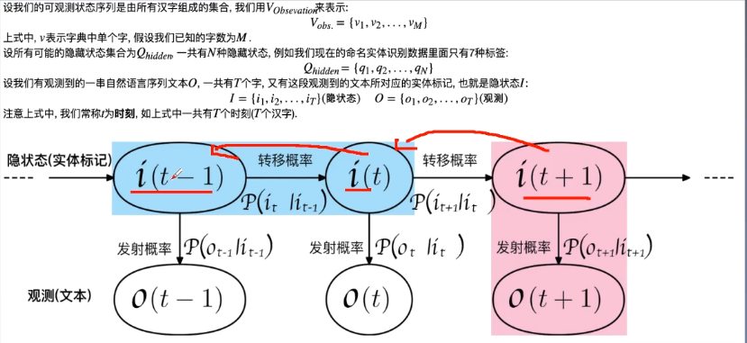

# 命名实体识别

## 研究背景

信息抽取 = 命名实体识别+关系抽取

### 数据处理-序列标注

BIO

1. B-begin: 实体的开始
1. I-inter： 实体的中间
1. O-outer： 不是实体

## 常见模型

### HMM

#### 概率图模型：

概率图模型主要分为两类：

1. 有向图模型： 贝叶斯网络
1. 无向图模型：马尔可夫网络

hmm的三个问题

1. 概率计算问题：已知模型和观测序列，计算在该模型观测序列出现的概率
1. 学习问题：已知观测序列，估计模型的参数
1. 预测问题：已知模型参数和观测序列，求最有可能的状态序列

根据训练的数据中是否包含对应的状态序列，分为

1. 监督学习：极大似然估计
1. 非监督学习：EM算法

### CRF

crf的转移特征和状态特征类似于hmm的转移概率和发射概率

注意比较crf和hmm的不同

1. crf的隐状态序列是左右可以相互影响的，但是hmm只能是从前往后的
1. crf的隐状态序列对应所有的观测值，但是hmm隐状态只对应当前的观测值

### BiLSTM-CRF

核心：

1. 双向lstm可以利用过去和未来的相关特征
1. CRF可以利用句子的特征
1. 效果更好，鲁棒性更强，对词向量依赖不强

为什么需要加CRF

因为bilstm得到的可能是I开头的，即I在B前面，有了CRF可以学习到句子的前后依赖，从而加入一些依赖来保证最终预测有效，这个主要加入转移分数

得分 = 发射分数+ 转移分数 也就是bilstm+crf的结果

CRF损失函数+维特比解码

时间复杂度

1. 维特比算法：D*N*N，栅栏图的长为N,宽为D.维特比算法在每两层之间比较D*D次，保留到下一层最长路径，依次递归，所以算法复杂度为O(N*D*D)
1. 暴力解法: D^N

损失函数

真实路径分数+所有路径分数的总分数。

缺点：

1.

### bert

## 其他问题

### MRC能否做命名识别

### 新词发现

[新词发现](https://mp.weixin.qq.com/s?src=11&timestamp=1615299304&ver=2936&signature=vfcnojK*8hBiwcthZ2DknGavTdkOR2L658iki1XtLU1IA4a67HG78A74DlV9Y7WyEnnL3H8RY0MC*VfJ5MRH0w5AiZHfiChLauQXe4LY7EodJJ6moswiF4vu9HtVueCN&new=1)

