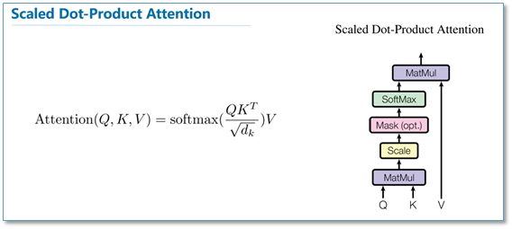
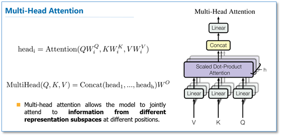

# 基础模型

## CNN

## RNN

## ELMO

## transformer

----

1. attention 计算公式  
1. multiattention 是多个attention的组合之后并进行concat
1. attention 中的Q,K,V 都相等时就是self-attention, 目的是学习句子内部的词依赖关系，捕获句子的内部结构

-----

