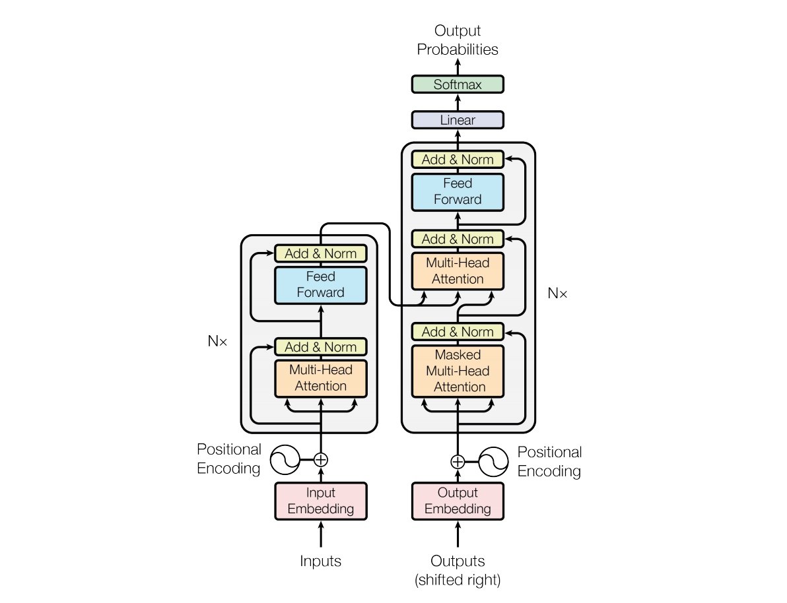

# 基础模型

## 基础知识

### Normalization

-------

1. Normalization 主要是将数据进行白化（独立同分布）操作。通用框架是先归一化，然后再进行平移和伸缩变换
1. BatchNorm ：纵向规范化. 适用于每个 mini-batch 比较大，数据分布比较接近。训练前要进行 shuffle。但不适用于动态的网络结构和RNN
1. LayerNorm : 横向规范化.

-------

### 激活函数

sigmoid 和 softmax的区别

1. sigmoid 一般用于多标签分类
1. softmax 一般用于多分类 因为softmax会对整体的概率进行归一化

### 优化器

#### SGD

#### Adam

-----

1. Adam 全名：adaptive moment estimation。适应性矩估计。
1. 随机梯度下降保持单一的学习率（即 alpha）更新所有的权重，学习率在训练过程中并不会改变。 Adam 通过计算梯度的一阶矩估计和二阶矩估计而为不同的参数设计独立的自适应性学习率。
1.

-----

## CNN

### 卷积

1. Conv1D, Conv2D: Conv1d 沿着一个方向卷积,Conv2d沿着两个方向卷积

## RNN

## LSTM

lstm 与 GRU的区别

1. 它将忘记门和输入门合成了一个单一的 更新门。同样还混合了细胞状态和隐藏状态，和其他一些改动。
1. 最终的模型比标准的 LSTM模型要简单。效果和LSTM差不多，但是参数少了1/3，不容易过拟合。

## ELMO

----

1. ELMO 主要解决 一词多义的情况
1.

----

## transformer

----

1. attention 计算公式
1. multiattention 是多个attention的组合之后并进行concat
1. self-attention: attention 中的Q,K,V 都相等, 目的是学习句子内部的词依赖关系，捕获句子的内部结构

-----
[答案解析(1)—史上最全Transformer面试题：灵魂20问帮你彻底搞定Transformer](https://mp.weixin.qq.com/s?__biz=MzIyNTY1MDUwNQ==&mid=2247483703&idx=1&sn=29b8058e8e1427e442e8610a95c157af&chksm=e87d3311df0aba0714742f1a4b0f5b37495f9b1f55f2223fd8f2e56b19f966a0c643f0c973aa&scene=178&cur_album_id=1390927898143735808#rd)

1. 为什么要用MHA: 多头注意力机制能够捕捉更丰富的信息，本质上是作者发现这样的做法更好
1. transformer中QKV为什么使用不同的权重：使用不同的权重可以投射到不同的空间，增强表达能力和泛化能力
1. attention的时候为何选择点乘而不是加法:

transformer encoder的

1.f

## Word2Vec

### skip-gram

### cbow

## 分类模型

### fasttext

1. fasttext和cbow的结构类类似,但是fasttext是预测的标签,但是CBOW预测的是中间词
1. fasttext的输入是n-gram的词,那么输入的维度异常的大(todo,默认的n是用的?)
1. fasttext 为什么那么快,还有n-gram会严重的占用内存(todo)

为啥要使用n-gram

1. n-gram 能获取到词序的相关信息,
1. 罕见词很少出现,但是和周边词出现可以优化生成的单词向量

[代码实现](../learn_torch/classification/fasttext.py)

### textCNN

###                                   

### 其他问题

1. 什么情况下用词向量,什么情况下用字向量
