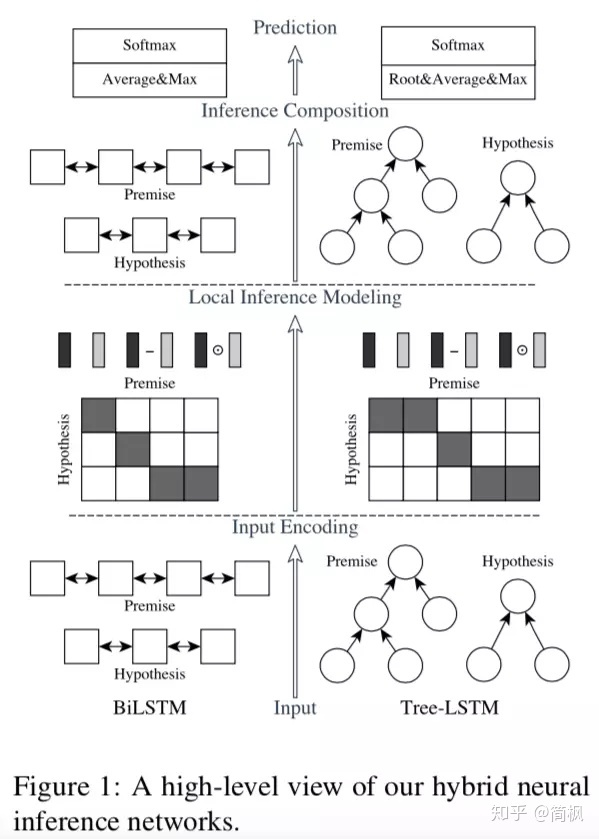
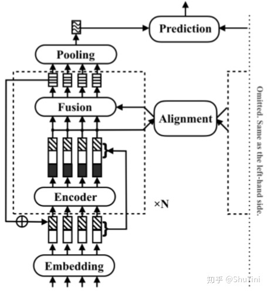

# 文本匹配

## 常见模型

## siamese 网络

----

1. Siamese Network有两个结构相同，且**共享权值**的子网络,这区别于DSSM
1.

---

### ESIM

---

1. ESIM 核心：交互方式。对单词之间的交互矩阵，分别按照行做softmax和列做softmax获得两个句子之间的交互结果

---

### RE2

----

1. RE2 名字来源：Residual 网络，Embedding vectors；Encoded vectors;
1. 残差网络如何融入模型中：
    1. block内：block input = embedding + 前两层输出和
    1. block外：embedding + 前两层输出和 + encoder 输出

----

### matchpyramid

### textCNN

## LTR的方案

-----
-----

### pointwise

---

1. pointwise 将模型视为一个二分类问题，样本数据输入(用户问，答案，是否正确)

---

### pairwise

---

1. pairwise 的样本输入是(用户问，正样本，负样本)
1.

---

### listwise

---

1. listwise的样本输入是
1. listwise 常用的模型有LambdaMART，

---
