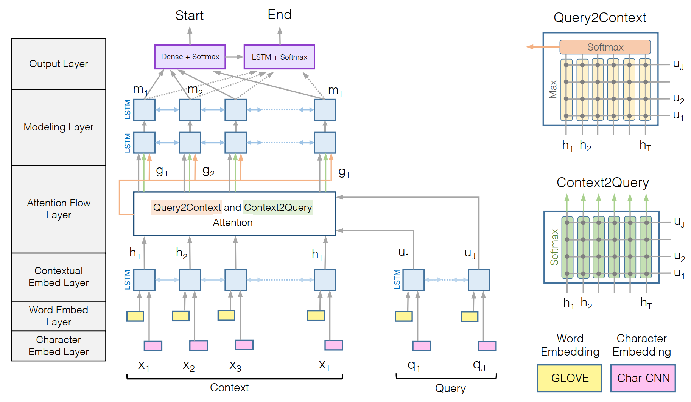

# MRC

---

1. MRC任务涉及context和query得到answer
1. MRC常见的模型主要涉及bidaf，qanet，bert
1. 可以将一些常见的ner、分类等任务等等转化为MRC任务

---

## MRC概述

MRC 任务是三元组求解任务（query,context,answer）

## MRC模型

### bidaf

1.

### bert

[bert](./bert.md)

### qanet

## MRC在业务上的应用

1.

## MRC在其他NLP任务上的应用

1. NER任务

